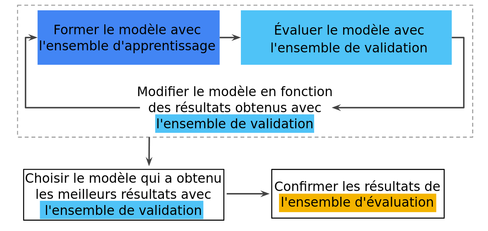
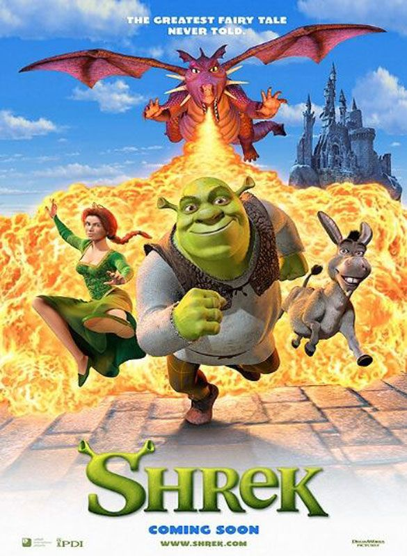

# Classification des genres  de films à partir des affiches/images utilisant CNNs
## Introduction
### Description du problème 

Ce projet a pour objectif de parvenir à une classification des genres de films basée uniquement sur des des affiches de films.
Pour les spectateurs, les affiches de films sont très significatifs  pour avoir une idée du contenu du film et de son genre. Les humains peuvent avoir une idée en se basant sur les couleurs, les objets, les expressions du  visages des acteurs, etc.. pour déterminer rapidement le genre (horreur, comédie, animation, etc.).
Si les humains sont plus ou moins capables de prédire le genre d'un film en ne regardant que son affiche, alors nous pouvons supposer que l'affiche possède certaines caractéristiques qui pourraient être utilisées dans les algorithmes d'apprentissage machines pour prédire son genre.

### Approche proposée
Pour ce faire, un Deep Neural Network (Convolutional Neural Network) est construit pour attribuer un genre à une affiche de film donnée. Puisqu'un film peut appartenir à plusieurs genres, il s'agit d'un problème de classification d'images multi-étiquettes mais dans notre projet on se contntera de déterminer le genre dominant.

### Web Scraping 
Afin de créer notre base de données, nous avons téléchargé des images des posters des films pour chaque genre depuis Google Images. Pour cela, nous avons utilisé un code écrit en JavaScript (voir js_console.js). On a injecté ce dernier dans la console de Google Chrome pour générer les urls de toutes les images présentes dans la page. Ensuite, nous les avons téléchargées à l’aide d’un code Python (download_images.py).

### Partitionnement du dataSet en trois sous-ensembles (Entrainement, validation, Test)
On split notre data en trois ensembles :  entrainement pour entrainer notre reseau, validation pour évaluer les résultats de l'ensemble d'apprentissage, Test pour reverifier (double-check) l'évaluation après que le modèle a passé l'étape de validation. La figure suivante présente le  workflow :

    

### Pronostic
Puisque même un humain peut facilement faire des erreurs dans cette tâche, notre objectif initial est de reconnaître correctement au moins la moitié des films.
Notre data Set (images, voire labels) peut etre sujet de modification ou ajustement au cours de notre projet au cas ou on  rencontrera des difficultés.   
(sources and related links: 

### Quelque images de notre  DB !

    

    

    

    

    

